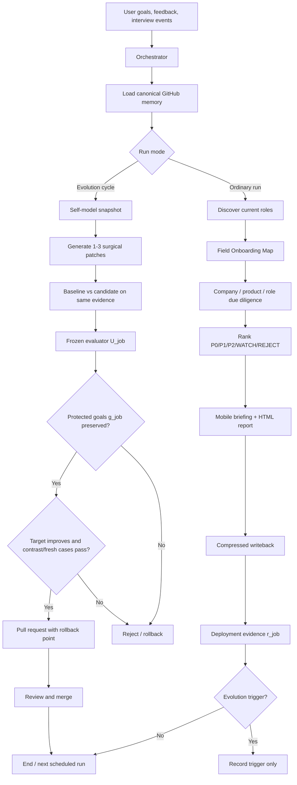
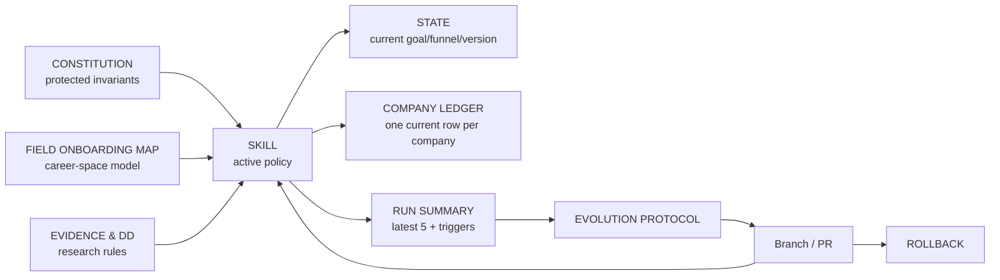
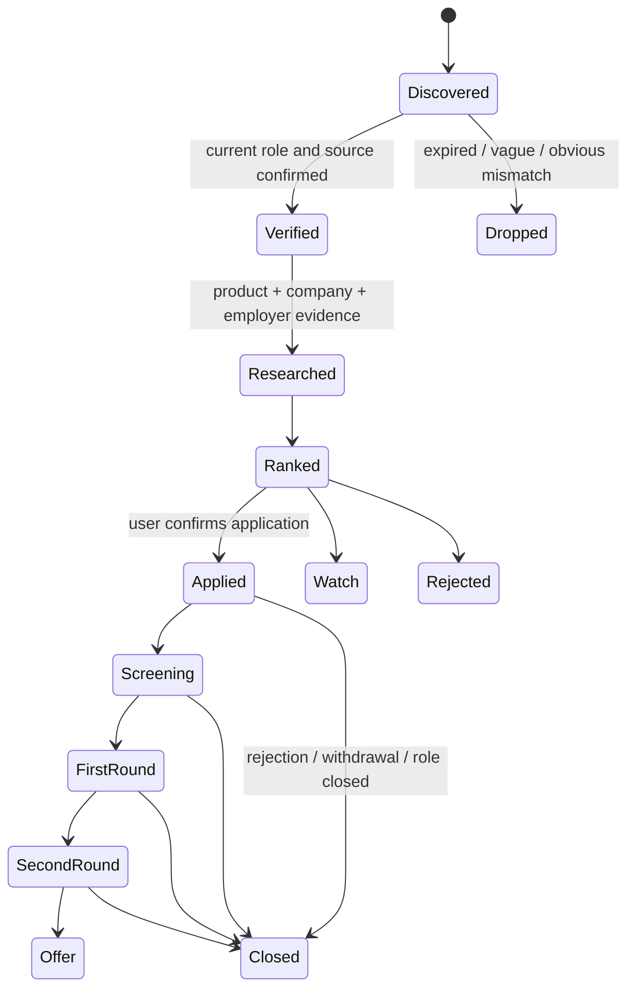

# Architecture

## Control objects

The project separates five control objects:

- `π_job` — executable job-search policy (`SKILL.md`).
- `I_job` — evolution procedure (`docs/EVOLUTION_PROTOCOL.md`).
- `U_job` — frozen evaluator (`evals/EVALUATION_TASKS.md` and reviewer gates).
- `r_job` — deployment evidence (`memory/RUN_SUMMARY.md`, reports, user/recruiter feedback).
- `g_job` — protected goal and invariants (`docs/CONSTITUTION.md`).

A candidate patch may change `π_job` or, in a separate cycle, `I_job`; it may not change the target behavior and its own acceptance gate in the same cycle.

## System map

## Memory architecture

## Agent roles

The roles are logical responsibilities, not mandatory separate processes.

| Role | Job |
|---|---|
| Orchestrator | Select run mode, route mix, workload and stop conditions. |
| Source Scout | Find current openings and high-quality company/product sources. |
| Role Analyst | Map JD to actual product, customer, economics and daily work. |
| Company Analyst | Evaluate outlook, product position, commercial quality and employer risk. |
| Field Map Builder | Maintain directions, transitions, capability gaps and bridge roles. |
| Application Strategist | Choose resume version, contact path and interview narrative. |
| Reviewer | Apply frozen evidence, ranking, output and regression gates. |
| Memory Steward | Compress updates and prevent prompt/document bloat. |
| Evolution Steward | Run isolated candidate patches, tests and rollback. |

## Data lifecycle

## Change boundaries

- Runtime evidence can change state, ledger and run summary.
- Company-specific findings never enter the global skill.
- Stable user preferences enter the ledger only after they affect future decisions.
- Global policy changes require an evolution PR.
- Evaluator changes require a separate evaluator-evolution PR with the target policy frozen.
