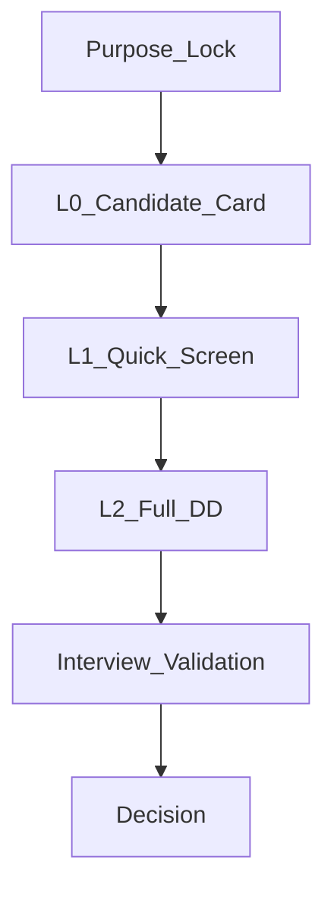

# Company DD Workflow

Status: reference v1

## Purpose

Company DD should answer one practical question: can this company and role improve long-term career capital while meeting realistic compensation, work-style and employer-quality constraints?

## Overall flow

## Stage 0: Purpose Lock

Record:

- company and role;
- city and expected work location;
- target business unit or product line if known;
- current decision stage: pre-application, pre-interview, post-interview or offer;
- the user's main question.

## Stage 1: L0 Candidate Card

L0 is for fast discovery. It should stay short.

| Field | Purpose |
|---|---|
| Company / city | identity and location fit |
| Subsector | field fit |
| Product one-liner | what is sold |
| Customer one-liner | who buys or uses it |
| YRD role presence | whether it is actionable |
| Role relevance | whether it matches the candidate |
| AI/tech adjacency | long-term direction fit |
| Initial stage | continue, watch or stop |

## Stage 2: L1 Quick Screen

L1 uses six modules:

1. company development and operating condition;
2. industry and technology trend;
3. product competitiveness and sellability;
4. customers, channels and overseas business;
5. employer and role quality;
6. candidate entry ecology.

L1 output should include rating, largest unknown, and top validation questions.

## Stage 3: L2 Full DD

L2 is reserved for companies worth serious interview or offer consideration.

### Module A: company development and operating condition

Review legal entity, governance, capital stage, revenue, profit, cash flow, margin, R&D, certification, litigation and public risk.

### Module B: industry and technology trend

Review value-chain position, 3-5 year demand drivers, AI/digital impact, substitution risk, China advantage, YRD cluster and key players.

### Module C: product competitiveness and sellability

Review core products, growth products, supporting products, experimental products, product moat, competitors, selling points and real circulation evidence.

### Module D: customers, channels and overseas business

Review user, buyer, budget owner, purchase trigger, non-purchase reasons, overseas revenue, country structure, distributor or agent evidence, ODM/OEM/OBM split and lead source.

### Module E: employer and role quality

Review fixed compensation, variable compensation, payout basis, work system, team attainment, ramp period, customer ownership, manager risk and employee samples.

### Module F: candidate entry ecology

Review the product, customer/channel, control rights, capability accumulation, AI/high-tech bridge, 2-3 year next jump and opportunity cost attached to the role.

## Evidence labels

Use four labels:

- Fact;
- Inference;
- Unknown;
- Insufficient evidence.

## Output levels

| Level | Output |
|---|---|
| L0 | Candidate Card |
| L1 | Six-module Quick Screen |
| L2 | Full DD Report |
| L3 | Interview Validation Sheet |
| L4 | Offer Decision Sheet |
