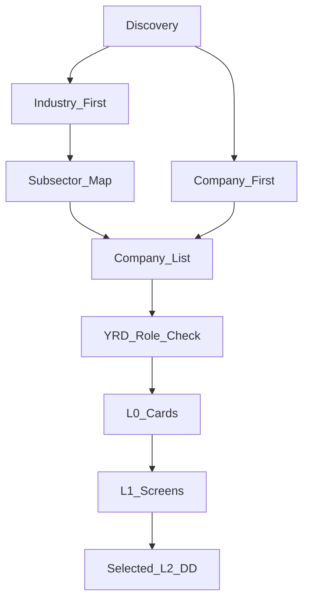

# Daily Discovery Workflow

Status: reference v1

## Purpose

This workflow helps build a long-term map of promising Yangtze River Delta companies and roles.

The discovery system uses two entrances:

1. Industry first: start from future-facing subsectors, then find companies and roles.
2. Company first: start from strong YRD companies, then check their industry, products and roles.

## Flow

## Industry-first entrance

Useful subsector groups:

- AI infrastructure and data-center supply chain;
- semiconductor equipment, materials, memory and storage;
- robotics, machine vision and intelligent hardware;
- industrial software and digital manufacturing;
- medical devices and digital health;
- laboratory automation, testing and inspection equipment;
- energy storage, power electronics and industrial automation;
- 3D printing and advanced manufacturing niches.

For each subsector, capture:

| Field | Purpose |
|---|---|
| AI connection | whether AI increases demand or changes the value chain |
| China advantage | whether China has supply-chain or engineering strength |
| YRD cluster | whether Shanghai, Hangzhou, Suzhou, Ningbo, Nanjing or Wuxi have company density |
| Head companies | visible leaders |
| Hidden champions | niche companies with strong ecology |
| Relevant roles | overseas sales, channel, BD, solution, product operations |

## Company-first entrance

For YRD companies found through hiring platforms, exhibitions, parks, referrals or media, capture:

| Field | Purpose |
|---|---|
| Company and city | identity and location |
| Product | what is sold |
| Customer | who buys |
| Subsector | industry context |
| Role family | candidate fit |
| AI/tech adjacency | future relevance |
| Employer signal | work-system and team risk signal |
| Next stage | L0, L1 or archive |

## Suggested rhythm

| Frequency | Action | Output |
|---|---|---|
| Weekly | review 3-5 subsectors | industry map delta |
| Daily | scan 6-7 companies | L0 cards |
| Daily | screen 2-3 companies | L1 dashboards |
| Daily or alternate day | deep-dive 1 company | L2 report |
| Weekly | update maps | watchlist updates |

## Living maps

Maintain three maps:

1. Industry map: subsector, AI connection, China advantage, YRD cluster.
2. Company map: head companies, hidden champions, YRD teams.
3. Role map: role family, opening status, fit level and evidence gaps.

## Compression rule

Discovery output should remain stage-appropriate. L0 is a candidate card, L1 is a dashboard, and L2 is a full report.
