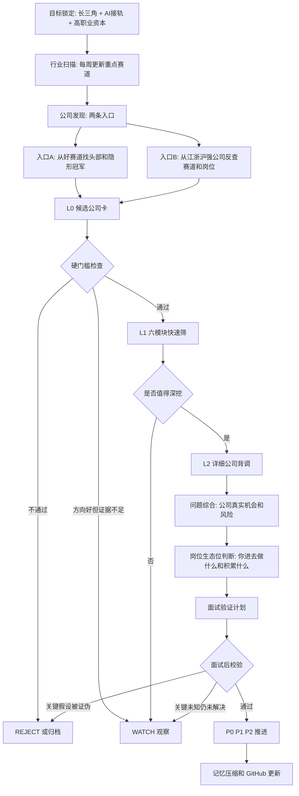

# Daily Sector Rotation Workflow

Status: reference v1

## Purpose

This workflow prevents the daily job-search agent from repeatedly searching the same type of company. The daily report should rotate across industries and build a long-term map of sectors, companies, roles, risks and candidate entry paths.

The goal is not to find a random list of jobs. The goal is:

`Yangtze River Delta + AI adjacency + high career capital + role ecology that can compound the user's existing overseas technical-commercial experience.`

## Canonical flow

## Daily sector-rotation rule

Each daily run must select a different sector mix from the July cache and recent daily deltas.

Rules:

1. Do not make robotics / embodied AI the main sector two days in a row unless there is an active interview, application deadline or user instruction.
2. If the previous run focused on robotics, the next run should prioritize large-model commercialization, AI infrastructure, industrial software, semiconductor/data-center supply chain, medical/advanced devices or energy/industrial automation.
3. Each daily report should include 3-5 sector mini-reports, not just company lists.
4. At least 2 sectors must be new or underexplored compared with the previous daily delta.
5. Repeated companies may appear only when closing an evidence gap or moving from L0 to L1/L2.
6. A company cannot be promoted only because the product looks exciting; current role and user-fit evidence still matter.

## Weekly sector map

At the start of each week, refresh 6-8 possible sectors:

| Sector | Why it belongs in the map | Typical role families |
|---|---|---|
| Robotics / embodied AI / intelligent hardware | AI moves from software into physical-world deployment | overseas sales, solution, channel, technical BD, product ops |
| Industrial automation / machine vision / AMR | YRD has manufacturing and logistics customer density | solution sales, KA, channel, overseas BD, product marketing |
| Large-model commercialization / MaaS / enterprise AI | Direct second-curve path from technical commercial experience | MaaS BD, AI solution sales, ecosystem, CS, product ops |
| AI infrastructure / vector DB / data/cloud / model eval | AI application growth creates infra and developer-tool demand | GTM, developer relations, solution, ecosystem, customer success |
| Semiconductor / storage / data-center supply chain | AI compute drives demand for chips, memory, cooling, equipment | overseas sales, solution, channel, strategic accounts |
| Industrial software / PLM/MES/CAE/digital manufacturing | China manufacturing upgrading creates software adoption needs | solution sales, implementation BD, customer success, product ops |
| Medical technology / advanced devices / testing | Specialized product + overseas channel can compound experience | international BD, distributor management, product specialist |
| Energy storage / power electronics / industrial automation | China supply chain advantage and overseas demand | overseas sales, channel, solution, regional BD |

## Daily output structure

Every daily run should output the following sections in this order:

1. GitHub Preflight Checklist.
2. Loaded Operating Constraints.
3. Sector Rotation Decision: what was covered recently, what is intentionally covered today, and what is intentionally skipped.
4. Phone-readable executive summary.
5. Industry Scan: 3-5 sector mini-reports.
6. Company Discovery: two entrances.
7. L0 Candidate Cards: 8-12 companies.
8. Hard Gate Table: pass / watch / reject.
9. L1 Six-Module Quick Screens: 3-4 companies.
10. L2 Detailed Company DD: 1-2 companies.
11. Problem Synthesis: real opportunity and risk.
12. Role Ecology Judgment: what the user would do and accumulate.
13. Interview Validation Plan.
14. Mermaid status view.
15. HTML report when possible.
16. GitHub writeback summary.

## Sector mini-report standard

For each sector, cover:

- why this sector matters now;
- AI connection;
- China/YRD advantage;
- product and value chain;
- buyer, user and budget owner;
- revenue model / pricing / sales motion where visible;
- typical implementation flow: PoC, sample, tender, deployment, acceptance, renewal;
- suitable role families for the user;
- main risks;
- representative companies;
- what evidence is still missing.

## L0 candidate card standard

Each L0 card must include:

| Field | Requirement |
|---|---|
| Company / city | YRD preferred; non-YRD only if career value is exceptional |
| Sector | Link to today's sector map |
| Product | What is sold and to whom |
| Customer | Buyer/user/budget owner if visible |
| AI / tech adjacency | Direct, indirect or weak |
| Current role signal | Official / recruiter / platform / unknown |
| User-fit hypothesis | direct / bridge / stretch |
| Hard-gate risk | location, comp, work system, role reality, product reality |
| Largest unknown | one decision-changing unknown |
| Stage | L0-pass / WATCH / REJECT |

## L1 six-module screen

Promoted companies must be screened across six modules:

1. Company development and operating condition.
2. Industry and technology trend.
3. Product competitiveness and sellability.
4. Customers, channels and overseas business.
5. Employer and role quality.
6. Candidate entry ecology.

## L2 detailed company DD

L2 should be used sparingly. It should include:

- temporary conclusion;
- evidence map;
- company development and operating state;
- industry / technology trend;
- product competitiveness and sellability;
- customers, channels, overseas and deployment evidence;
- competitor/substitute map;
- current role evidence and JD extraction;
- employer/work-style risk;
- role economics: buyer, user, budget owner, sales/support boundary, PoC/sample/tender/deployment/acceptance, KPI;
- candidate fit: direct evidence, transferable evidence, missing proof;
- interview validation questions;
- final rating and next action.

## Hard gates

Reject or downgrade when:

- role is not current;
- location is outside preference without exceptional career value;
- fixed pay is unlikely to reach target and there is no exceptional transition value;
- work system indicates long-term single rest day or high intensity;
- product is only marketing with no customer/deployment evidence;
- employer risk is material and unresolved;
- role does not create durable career assets.

## Memory rule

Write back only compressed decision-changing changes:

- sector map deltas;
- company queue changes;
- evidence gaps opened/closed;
- L2 conclusions;
- interview validation questions;
- workflow improvement triggers.

Do not store raw search dumps, every reviewed company, every anonymous review or unsupported speculation.
