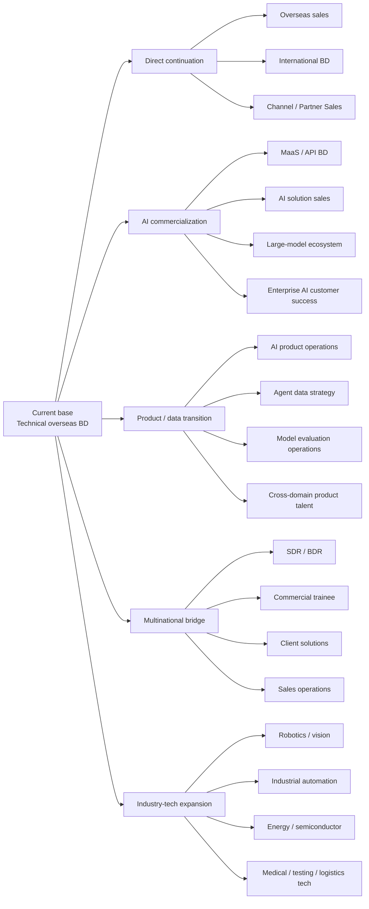

# Field Onboarding Map

This map prevents the search from collapsing into a single title or industry. It models the user's career field as a set of problems, capability threads, role families and transitions.

## Root problem

How can a candidate with strong technical-product overseas BD experience enter higher-quality, more defensible industries—especially enterprise AI and large-model companies—without discarding existing commercial seniority or accepting a low-value reset?

## Problem threads

### T1. Product-value translation

Convert complex technical capability into customer value, purchase logic, PoC criteria, adoption and expansion.

Evidence already available:

- fast learning of 3D-printing and new-energy products;
- technical parameters → application scenarios → customer language;
- customized product/solution negotiation;
- product/packaging/lead-time feedback loops.

Target roles:

- MaaS/AI solutions BD;
- solution sales;
- customer success;
- product operations;
- sales engineer/solution consultant bridge roles.

### T2. Market and customer intelligence

Use OSINT, customs data, account research and segmentation to identify high-value customers and market entry paths.

Target roles:

- industry BD;
- growth/market intelligence;
- Agent data strategy;
- AI product operations;
- partner/ecosystem operations.

### T3. Channel and ecosystem construction

Recruit, segment, activate and govern distributors/partners; design incentives and joint go-to-market.

Target roles:

- partner sales;
- ecosystem operations;
- channel BD;
- developer/ISV partner programs;
- international expansion.

### T4. Complex opportunity execution

Move a multi-party opportunity from discovery through solution, negotiation, delivery, adoption and expansion.

Target roles:

- enterprise account executive;
- solution BD;
- AI commercialization;
- large-account sales;
- implementation-aware customer success.

### T5. AI/Agent product evidence

Turn “uses AI tools” into demonstrable product and evaluation ability.

Needed artifacts:

- customer-intelligence Agent;
- MaaS scenario diagnosis and PoC design Agent;
- model/Agent badcase evaluation set;
- short product improvement memo;
- demo video and README.

## Role families

## Priority logic

Priority is dynamic, not permanent.

- **Campaign priority:** current roles at strong large-model/enterprise-AI companies that match the candidate or can be bridged with a portfolio.
- **Conversion priority:** direct-fit technical overseas BD and enterprise solution roles with verified compensation and current hiring.
- **Capability priority:** roles that build AI product, API/MaaS, enterprise software, partner ecosystem or complex solution skills.
- **Exploration reserve:** adjacent industries and role families remain visible to prevent overfitting to one market cycle.

## Transition gates

### Overseas BD → MaaS / AI solution BD

Must show:

- enterprise problem discovery;
- PoC and success criteria;
- API/Token/commercial basics;
- one AI scenario portfolio;
- ability to coordinate product, technical and delivery teams.

### Overseas BD → AI product operations

Must show:

- user journey and issue taxonomy;
- feedback/badcase analysis;
- product metric or adoption logic;
- one product-improvement document;
- evidence of structured iteration rather than content-only operations.

### Overseas BD → Agent data/product

Must show:

- task taxonomy;
- dataset/test-set construction;
- model comparison;
- error analysis;
- tool-use or workflow evaluation;
- clear human review and risk controls.

## Field update rule

The map changes only when evidence shows one of the following:

- a role family repeatedly converts or repeatedly fails;
- a new capability artifact changes the accessible role set;
- company/industry conditions materially alter the opportunity field;
- user preference changes the desired career identity;
- interview feedback reveals a missing capability or false assumption.

Map changes should split, merge, promote, downgrade or retire a thread. Do not append a new category for every job title.
