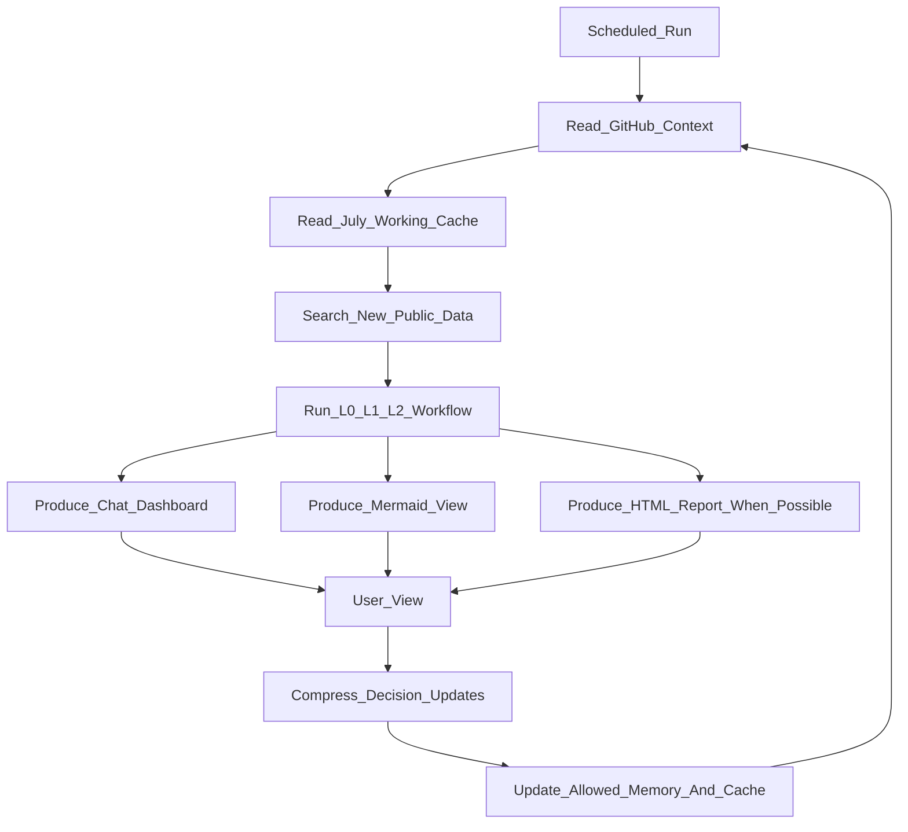
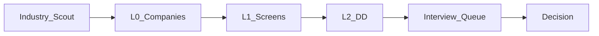

# GitHub Daily Loop

Status: reference v1

## Purpose

The daily job-search task should be GitHub-grounded. It should first read the repository context, then run discovery, then return a modular report, and finally suggest or write back only decision-changing updates.

The loop is not: run a daily prompt and then loosely update GitHub.

The loop is: GitHub state becomes the task context, the new run operates from that context, and the useful result returns to the repository as compressed working memory.

## Loop diagram

## Startup reading order

Each daily run should use `docs/RUN_LOAD_REFERENCE.md` as the reading map when available.

Typical context includes:

- protected goals and hard constraints;
- bounded evolution rules;
- current campaign state;
- preferences and company ledger;
- candidate evidence index;
- evidence and company due-diligence rules;
- Field Onboarding Map;
- daily discovery workflow;
- dashboard reference;
- scorecard and stage gates;
- July working cache;
- relevant templates.

## Daily run output

Each daily run should produce three views:

### 1. Chat dashboard

A compact but complete message containing:

- executive summary;
- direction map update;
- industry scan;
- L0 company cards;
- L1 quick screens;
- L2 candidate if warranted;
- role pipeline;
- interview queue;
- evidence gaps;
- next three actions.

### 2. Mermaid view

A status diagram showing the current pipeline and flow of decisions.

Example:

### 3. HTML view

When tooling permits, generate a single HTML report with:

- dashboard summary;
- tables for companies and roles;
- source links;
- evidence labels;
- memory suggestions;
- next actions.

If HTML cannot be generated, the run should state that honestly and still provide the chat dashboard.

## GitHub writeback

Writeback should be conservative.

Allowed outputs:

- July working-cache deltas;
- compressed run summary;
- stable company ledger updates;
- unresolved evidence gaps;
- proposed workflow improvements;
- confirmed interview feedback or candidate evidence.

Do not store:

- raw search dumps;
- every reviewed company;
- every anonymous review;
- temporary speculation;
- unsupported claims.

## July working cache

For July 2026, working cache lives under:

`memory/2026-07/`

It should contain lightweight files that help the next daily run continue from the previous one without bloating durable memory.

Suggested files:

- `README.md` — cache rules and current focus;
- `dashboard_state.md` — current visible dashboard state;
- `daily_deltas.md` — compressed daily changes;
- `company_queue.md` — companies awaiting L0/L1/L2;
- `evidence_gaps.md` — unresolved questions;
- `workflow_improvements.md` — proposed loop improvements.

## Quality rules

- GitHub context is read before new web search.
- New public search is used for current role and market facts.
- Report is modular, not a raw list.
- Major claims are labeled fact, inference, unknown or insufficient evidence.
- At most one company is promoted to L2 per daily run unless explicitly requested.
- Durable memory receives only decision-changing compression.
