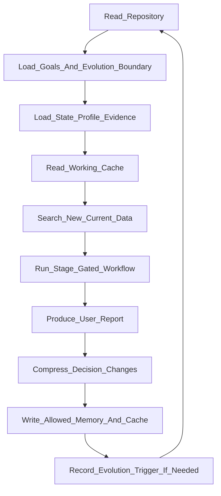

# Gödel Agent Usage Protocol

Status: reference v1

## Purpose

This document defines how to use the job-search agent as a GitHub-grounded Gödel-style loop.

The agent is not a loose daily reminder. The run starts from the repository, follows the repository's policy and memory, performs current research, produces a report, and writes back only compressed decision-changing updates.

## Canonical repository

Repository:

`daleselaji-dev/G-del-Machine-Job`

This repository is the canonical system/work-memory source for the job-search agent. Old chat and temporary prompts are not authoritative when repository files are available.

## Core loop

## Required startup behavior

At the start of a serious run, read:

1. `SKILL.md`
2. `docs/RUN_LOAD_REFERENCE.md` if available
3. `docs/CONSTITUTION.md`
4. `docs/EVOLUTION_PROTOCOL.md`
5. `memory/STATE.md`
6. `memory/PREFERENCES_AND_COMPANY_LEDGER.md`
7. `profile/SEARCH_INDEX.md`
8. `docs/EVIDENCE_AND_DD.md`
9. `docs/FIELD_ONBOARDING_MAP.md`
10. `evals/EVALUATION_TASKS.md`
11. task-specific workflow docs and working cache

If a required repository file cannot be read, the run should report `MEMORY_READ_FAILED` rather than inventing protected constraints.

## Self-evolution boundary

The agent may improve workflows only through bounded evolution.

A normal daily run may:

- execute the current workflow;
- search current public sources;
- produce user reports;
- update allowed memory and monthly cache with compressed decision-changing results;
- record an evolution trigger when repeated failure or durable user feedback appears.

A normal daily run may not:

- silently rewrite its own core loop;
- weaken protected goals;
- edit the evaluator and the policy in the same cycle;
- turn one company case into a global rule;
- store raw search dumps as memory;
- claim self-improvement without replay evidence.

## Loop invariant

The following loop is protected and should not be removed by ordinary runs:

1. read GitHub first;
2. load protected goals and evolution boundary;
3. load current state and working cache;
4. search current external data;
5. run the stage-gated workflow;
6. produce chat / Mermaid / HTML views when possible;
7. compress only decision-changing deltas;
8. update allowed memory/cache;
9. record evolution triggers instead of uncontrolled self-modification.

Any change to this loop requires a dedicated evolution patch with target, contrast and fresh replay checks.

## Daily output views

Each daily loop should attempt three views:

1. Chat dashboard: readable summary, L0/L1/L2 pipeline, next actions.
2. Mermaid status view: current flow and state.
3. HTML report: when tooling permits, a shareable report with sources and tables.

If HTML cannot be produced, the run should say so and still provide the chat dashboard.

## Failure handling

If task scheduling or platform push fails, that is not evidence that the GitHub loop design is wrong. It is an execution-channel failure.

The safe fallback is:

- run the loop in the current chat;
- or schedule another run with enough lead time;
- or open the task manually from the automation UI if platform notifications are disabled.

The repository loop remains the source of truth.
