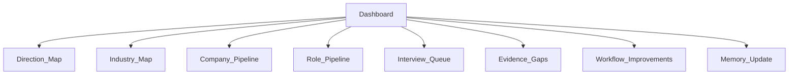

# Job Search Dashboard

Status: reference v1

## Purpose

The dashboard gives a compact view of the current job-search system without losing important research context.

It should answer:

- which directions are active;
- which industries and companies are being tracked;
- which roles are current and actionable;
- which companies need deeper due diligence;
- which interview questions or evidence gaps remain;
- what should be preserved as durable working memory.

## Dashboard layout

## 1. Direction map

| Direction | Status | Why it matters | Current next action |
|---|---|---|---|
| AI commercialization / MaaS / solutions | active | primary future-facing route |  |
| Intelligent hardware / robotics overseas roles | active | direct-fit high-tech route |  |
| Industrial software / automation / machine vision | active | YRD industry advantage |  |
| Semiconductor / storage / data-center supply chain | active | AI infrastructure adjacency |  |
| Medical technology / advanced devices | exploratory | specialized overseas channel asset |  |
| AI product operations / Agent data | portfolio-gated | second curve |  |

## 2. Industry map

| Industry | AI connection | China/YRD advantage | Priority | Open questions |
|---|---|---|---|---|
|  |  |  | P0/P1/P2/WATCH |  |

## 3. Company pipeline

| Company | City | Industry | Stage | Rating | Largest unknown | Next action |
|---|---|---|---|---|---|---|
|  |  |  | L0/L1/L2/Interview/Offer | P0/P1/P2/WATCH/REJECT |  |  |

## 4. Role pipeline

| Company | Role | Location | Source | Fit | Current status | Next action |
|---|---|---|---|---|---|---|
|  |  |  | official/JD/platform/referral | direct/bridge/stretch | current/uncertain/expired |  |

## 5. Interview queue

| Company | Role | Round | Top validation question | Deadline / next step |
|---|---|---|---|---|
|  |  |  |  |  |

## 6. Evidence gaps

| Gap | Affected company/direction | Why it matters | How to resolve |
|---|---|---|---|
|  |  |  | search / interview / user confirmation |

## 7. Workflow improvements

| Improvement | Trigger | Status | Next action |
|---|---|---|---|
|  |  | proposed/testing/accepted/rejected |  |

## 8. Durable memory update

Only preserve decision-changing information:

| Memory item | Destination | Reason |
|---|---|---|
| current field state | memory/STATE.md | campaign state |
| stable preference or company state | memory/PREFERENCES_AND_COMPANY_LEDGER.md | future ranking |
| run summary or unresolved trigger | memory/RUN_SUMMARY.md | compression |
| confirmed experience or interview feedback | profile/EXPERIENCE_APPEND_ONLY.md | candidate evidence |

## Daily dashboard output

Each daily run should produce:

1. executive summary;
2. direction map update;
3. 6-7 L0 company cards;
4. 2-3 L1 quick screens;
5. at most 1 L2 deep-dive candidate;
6. interview queue update;
7. durable memory suggestions;
8. next three actions.
