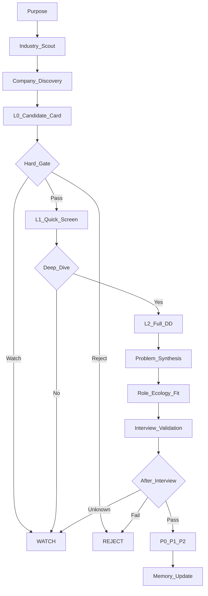

# Workflow Improvement Plan

Status: proposed workflow-system v1
Date: 2026-07-07
Scope: company due diligence, daily discovery, presentation compression, and startup protocol integration

## 1. Purpose

This plan converts recent user feedback into a durable, staged workflow for finding high-career-capital companies and roles in the Yangtze River Delta.

The system should optimize for:

- long-term career capital rather than short-term interview volume;
- companies whose industries, products and ecosystems remain competitive in an AI-driven economy;
- roles that preserve or improve the candidate's technical overseas BD seniority;
- realistic employment quality: fixed compensation, work system, team quality and manager risk;
- evidence-traceable conclusions with clear unknowns.

## 2. Problem diagnosed

Recent company-research runs became comprehensive but risked information overload. The user needs two separate layers:

1. Research layer: broad, evidence-seeking, source-complete, stage-gated.
2. Presentation layer: modular, decision-oriented, fast to read, with detailed report available only when needed.

The system must avoid collapsing into either:

- shallow company recommendations based only on brand/funding/marketing; or
- overlong reports that do not answer whether the role provides a good entry ecology.

## 3. Target operating model

## 4. Core design principles

### 4.1 Stage gates before conclusion

Each stage has entry conditions, done criteria, failure signals and downgrade actions. A company cannot move to a higher research stage just because it is interesting.

### 4.2 Research completeness, presentation compression

Research should cover the full evidence map, but the user-facing view should be compressed into six decision modules:

1. company development and operating condition;
2. industry development and technology trend;
3. product competitiveness and sellability;
4. customers, channels and overseas business;
5. employer and role quality;
6. the candidate's entry ecology and career assets.

### 4.3 Ecology fit is the final target

The final question is not only whether a company is good, but whether the candidate can enter a useful ecology inside the company:

- what product will be sold or operated;
- which customer/channel ecosystem will be entered;
- what resources and decision rights the role has;
- what career assets accumulate in 2-3 years;
- whether the role can bridge toward AI, intelligent hardware, industrial technology, enterprise software or other defensible fields.

### 4.4 Evidence status is mandatory

Material statements must be marked as:

- Fact;
- Inference;
- Unknown;
- Insufficient evidence.

Unknowns are not report defects; they are interview-validation targets.

### 4.5 Bounded evolution

Workflow improvements should be handled as bounded evolution, not ad-hoc prompt growth. Startup tasks that involve policy/workflow changes should load the evolution protocol and record triggers rather than silently changing protected policy.

## 5. Files introduced by this improvement

- `docs/STARTUP_MANIFEST.md` — task-specific startup load order, including evolution protocol.
- `docs/COMPANY_DD_WORKFLOW.md` — staged company due-diligence workflow.
- `docs/DAILY_DISCOVERY_WORKFLOW.md` — daily/weekly company and industry discovery workflow.
- `docs/DD_PRESENTATION_STANDARD.md` — dashboard, full report and interview-validation output standards.
- `docs/SCORECARD_AND_STAGE_GATES.md` — rating, hard gates and scoring system.
- `templates/company_l0_candidate_card.md` — low-overhead candidate card.
- `templates/company_l1_quick_screen.md` — six-module quick-screen template.
- `templates/company_l2_full_dd_report.md` — detailed DD report template.
- `templates/interview_validation_sheet.md` — interview verification template.
- `templates/offer_decision_sheet.md` — final offer decision template.

## 6. Deployment plan

### Step 1 — Add workflow documentation

Add this plan and the workflow documents on an evolution branch.

### Step 2 — Add templates

Add templates for L0, L1, L2, interview validation and offer decision.

### Step 3 — Review against protected rules

Check that the new workflow does not weaken:

- evidence traceability;
- company outlook gates;
- employer risk gates;
- user constraints;
- memory compression boundaries;
- evolution protocol separation.

### Step 4 — Replays

Run three replay cases before merging:

1. Target replay: a company DD task similar to the Pute Medical workflow-design problem.
2. Contrast replay: a normal job-search task that must not become too heavy.
3. Fresh replay: a new company quick screen that must produce L0/L1 output without information overload.

### Step 5 — Merge and monitor

If accepted, merge and monitor the next three comparable runs. Roll back if the workflow creates unnecessary complexity, hides evidence gaps, or lowers career-quality gates.

## 7. Non-goals

This workflow does not automatically recommend companies. It creates a structured research and decision system.

This workflow does not replace the Constitution, Evidence rules, Field Onboarding Map or Evolution Protocol. It is subordinate to them.

This workflow does not require every company to receive a full due-diligence report. Most companies should stop at L0 or L1.
