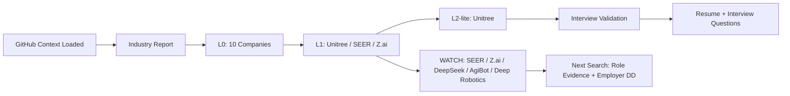

# Gödel Daily Job Report — Deep Test — 2026-07-08

Status: completed with `HTML_FAILED` because sandbox file creation was unavailable in the automation runtime.

## Executive summary

- L2-lite company: Unitree / 宇树科技. It is the only company in this run with verified YRD location, official current matching roles, strong product evidence and strong candidate-evidence transfer.
- L1/WATCH company: SEER Robotics / 仙工智能. Product/ecosystem signal is strong, but current role evidence remains unverified.
- Strategic WATCH: Z.ai / 智谱 and DeepSeek remain important for AI commercialization and Agent/MaaS direction, but current Hangzhou/Shanghai role evidence was not verified in this run.

## Strongest signals

1. Unitree official careers page lists current Hangzhou roles: solution engineer, technical support engineer, overseas sales specialist/manager and KA sales manager/director.
2. Reuters reported on 2026-07-03 that Unitree won approval for a Shanghai STAR Market IPO to raise RMB 4.2B for robot AI models, robot body research, new products and a smart robot manufacturing base.
3. SEER official site shows a robot-controller/software/AMR platform stack and recent overseas-growth/listing news, but no current matching role was verified.

## Largest risks

1. Employer DD remains incomplete: salary, work system, manager quality and team attainment need 职Q/看准/脉脉/BOSS/面试 cross-checks.
2. Unitree roles may involve heavy project delivery, site work, tendering and after-sales pressure.
3. Large-model companies are strategically strong, but role actionability is still weaker than Unitree today.

## Industry report

| Direction | Why it matters | AI connection | YRD/China advantage | Buyer/user/budget | Suitable role families | Main risk | Representative companies |
|---|---|---|---|---|---|---|---|
| Robotics / embodied AI / intelligent hardware | Humanoid and quadruped robots are moving from demos toward research, inspection, education, logistics and service scenarios. | Multimodal perception, control, RL, robot data, edge inference. | Hangzhou/Shanghai startup cluster, supply chain, universities and manufacturing. | Factories, research labs, government/enterprise, emergency, power, education. | Solution engineer, overseas sales, KA sales, technical support, product/data operations. | Early commercialization, heavy delivery, demo hype vs repeat purchase. | Unitree, Deep Robotics, AgiBot, Fourier. |
| AMR / industrial automation / machine vision | Warehouse and manufacturing automation has clearer near-term ROI. | AMR scheduling, vision, path planning, digital twin and fleet software. | Dense manufacturing/customer base across Shanghai, Suzhou, Hangzhou, Ningbo and Wuxi. | 3PL, warehouses, auto, 3C, new-energy and semiconductor factories. | Solution sales, overseas channel, KA, customer success, pre-sales. | Integration burden, margin, receivables, after-sales responsibility. | SEER, Hikrobot, Quicktron, Geek+. |
| Large model / MaaS / enterprise AI / Agent commercialization | Enterprise AI spend depends on PoC, private deployment, knowledge bases and Agent workflow, not model hype alone. | LLM, RAG, Agent, model evaluation, API/token economics. | Hangzhou has AI policy/cluster signal; Shanghai has enterprise and multinational customers. | CIOs, business units, digital teams, government, finance, manufacturing, education. | MaaS BD, AI solution sales, customer success, AI product operations, Agent data/evaluation. | Price war, compute constraints, custom delivery burden, high technical language barrier. | Z.ai, DeepSeek, Alibaba Cloud, Volcano Engine, ModelBest. |
| AI infrastructure / vector DB / data cloud / developer tooling | AI adoption requires data, retrieval, evaluation, monitoring, security and deployment tooling. | Vector search, RAG, LLMOps, evaluation, inference serving. | Cloud/data/customer base in Shanghai/Hangzhou; stronger fit if commercial role is solution/ecosystem. | Developers, AI platform teams, data teams, enterprise IT. | Customer success, solution, developer ecosystem, product operations. | Roles may be too technical; commercial roles need API/architecture fluency. | Zilliz, Alibaba Cloud, Volcano Engine, ModelBest, PingCAP. |
| Domestic AI chip / data center / semiconductor supply chain | Inference demand and export restrictions push domestic chips, servers, storage, interconnect, cooling and packaging. | Training/inference chips, GPU/accelerator cards, model adaptation, clusters. | YRD semiconductor equipment/materials/packaging/data-center supply chain. | Cloud providers, AI firms, government compute centers, data centers, labs. | Industry sales, solution, ecosystem cooperation, overseas channel. | Cyclicality, policy volatility, customer concentration, technical-route uncertainty. | Moore Threads, Cambricon, Biren, Enflame, Ascend ecosystem. |

## L0 company pool

| Company | City | Product / position | Current role signal | Stage | Largest unknown |
|---|---|---|---|---|---|
| Unitree / 宇树科技 | Hangzhou | quadruped robots, humanoids, robotic arms, perception, components, inspection/fire solutions | Official current Hangzhou roles: solution engineer, technical support, overseas sales, KA sales | L2-lite / P1 | salary, work system, sales/support boundary, team quality |
| SEER Robotics / 仙工智能 | Shanghai | AMR controllers, robots, M4, RDS, software platform | current matching role not verified | L1 / WATCH | current roles and employer DD |
| Deep Robotics / 云深处 | Hangzhou | quadruped/humanoid robots for inspection, emergency, tunnel, metallurgy, surveying | official/BOSS role evidence blocked | L0-pass / WATCH | current role and pay/work-style |
| AgiBot / 智元机器人 | Shanghai | humanoid robots, embodied data/factory/platform | matching commercial/solution role not verified | WATCH | role openness and commercialization maturity |
| Fourier / 傅利叶智能 | Shanghai | rehab robots, humanoid GR series | role not verified | WATCH | medtech sales path and pay/work-style |
| Hikrobot / 海康机器人 | Hangzhou | machine vision, mobile robots, industrial automation | specific matching role not verified | P2/WATCH | YRD overseas/solution role fit |
| Z.ai / 智谱 | Beijing + Zhejiang/YRD ecosystem signal | GLM, MaaS, Agent, government/enterprise AI solutions | current Hangzhou/Shanghai role not verified | Strategic WATCH | current role, compute/regulatory/competition risk |
| DeepSeek | Hangzhou | LLM/API/inference; Reuters says it is developing AI inference chip | current commercial/product role not verified | Strategic WATCH | public hiring path and entry role |
| Moore Threads / 摩尔线程 | Beijing/national, YRD unverified | domestic GPU, AI training/inference, cloud/data-center solution | exact YRD sales/solution role not parsed | WATCH | city and role mapping |
| Zilliz | global/China-origin | Milvus/Zilliz Cloud vector database | China/YRD role not seen in this run | WATCH | China role availability |

## L1 screens

### Unitree / 宇树科技 — L2-lite / P1

- Fact: Official careers page shows Hangzhou roles across solution engineering, technical support, overseas sales and KA sales.
- Fact: The solution engineer role includes customer requirements, site survey, solution design, cost estimation, technical bid documents, end-to-end landing, product feedback, competitor-solution analysis and industry promotion.
- Fact: Reuters 2026-07-03 reported IPO approval and RMB 4.2B planned proceeds for robot AI models, robot body research, new products and smart manufacturing base.
- Inference: Solution engineer is the best career-asset entry because it combines product, customer, industry solution, competitor analysis and sales enablement.
- Unknown: fixed salary, work system, travel, team quality, sales quota, support boundary and delivery responsibility.
- Rating: P1, not P0.

### SEER Robotics / 仙工智能 — L1 / WATCH

- Fact: Official site shows Robot Controllers, Software, M4 Smart Logistics Management System, RDS, Autonomous Forklifts, Lifting Robots and Industry Cases.
- Fact: Official site shows 2026-07-01 overseas-growth news and 2026-06-24 listing news.
- Inference: Its controller/software/ecosystem position may be better than a pure hardware-sales route if matching commercial roles exist.
- Unknown: current openings, compensation, work system, commercial team quality, sales/delivery boundary.
- Rating: WATCH until current role evidence is found.

### Z.ai / 智谱 — Strategic WATCH

- Fact: Reuters 2025-03 reported state-backed funding and a focus on serving Zhejiang/YRD enterprises.
- Fact: Reuters 2025-04 reported overseas expansion and sovereign/localized AI-agent positioning.
- Fact: Reuters 2026-07-07 reported China is considering restrictions on overseas access to top AI models and named Z.ai among companies in the discussions.
- Inference: Z.ai remains highly relevant to MaaS/Agent commercialization.
- Unknown: current Hangzhou/Shanghai roles and candidate entry route.
- Rating: Strategic WATCH.

## L2-lite DD — Unitree

### Temporary conclusion

Unitree is worth immediate interview validation for the solution engineer route. Best route order: solution engineer > overseas sales specialist/manager > technical support engineer > KA sales manager/director.

### Company development and operating condition

- Fact: Unitree is a Hangzhou robotics company with official product lines spanning consumer/research quadruped robots, industrial quadruped robots, humanoids, robotic arms, perception and components.
- Fact: Reuters reported 2026-07-03 STAR Market IPO approval and RMB 4.2B planned proceeds.
- Inference: IPO approval and expansion funding strengthen resource signal but also increase growth/target pressure.

### Industry and technology trend

- Embodied AI is moving from demos into data loops, hardware platforms and application scenarios.
- Customer value depends on reliability, deployment, serviceability, integration and TCO, not just robot capability videos.

### Product competitiveness and sellability

- Fact: Official careers roles explicitly tie sales/solution work to robot industry projects and whole-solution promotion.
- Inference: Unitree has moved beyond standardized hardware sales into project/industry solution work.
- Unknown: revenue mix, repeat purchase, gross margin, customer retention and delivery burden by product line.

### Customers/channels/overseas

- Fact: Overseas sales JD names enterprises, exhibition halls and schools as target customers.
- Inference: Overseas sales may fit the user's direct experience but may be less strategic than solution engineering if it is mainly standard-product sales.
- Unknown: distributor structure, certifications, local support, spare parts, after-sales ownership and region quota.

### Employer and role quality

- Fact: Role location is Hangzhou.
- Unknown: fixed pay, variable pay, work system, overtime, travel, team attainment, manager quality and legal/employment details.
- Inference: Fast expansion may create career opportunity and organizational pressure simultaneously.

### Role economics

| Role | Buyer/user | Workflow | Career asset | Risk |
|---|---|---|---|---|
| Solution engineer | government/enterprise/industrial/research/venue customers | needs discovery, site survey, solution, cost, bid, landing, feedback | industry solution, pre-sales, competitor analysis, product feedback | heavy delivery/site/travel burden; technical depth gap |
| Overseas sales | overseas enterprise/school/venue/channel customers | prospecting, product pitch, quote, negotiation, order, receivables | overseas robotics product sales, channel market insight | standard-sales risk; receivables/after-sales burden |
| Technical support | paying customers and sales team | demo, training, delivery, troubleshooting, documentation, product feedback | product understanding and field experience | support path may cap commercial upside |
| KA sales | government, associations, research institutes, large SOEs | relationship, project intel, resource coordination, negotiation | KA/public-sector project logic | may depend on resources/relationships more than user's current edge |

### Candidate fit

- Direct evidence from profile index: overseas sales, international BD, channel/partner sales, KA, solution expression, customer training, product feedback, cross-functional delivery.
- Transferable evidence: technical-product overseas BD in 3D printing/new energy can transfer into robot value translation and channel/customer development.
- Missing proof: robotics vocabulary, solution/tender examples, robot PoC/deployment/acceptance understanding, competitor map.

### Interview validation questions

1. What is fixed salary and variable structure? What conditions trigger payout?
2. Does the solution engineer carry sales quota? Where is the boundary with sales, delivery and after-sales?
3. Which industries and product lines are the main revenue sources?
4. How long is the typical project cycle? Does it include site survey, tendering, acceptance or resident support?
5. For overseas sales, who owns certification, localization, spare parts and after-sales?
6. What was the team's attainment in the past 12 months? What is new-hire ramp period?
7. What is the real work system and travel intensity?
8. Is the role expansion headcount or replacement headcount?

## Mermaid status

## Role pipeline

| Priority | Company | Role | Status | Action |
|---|---|---|---|---|
| 1 | Unitree | Solution engineer | official current Hangzhou role | tailored resume + interview validation |
| 2 | Unitree | Overseas sales specialist/manager | official current Hangzhou role | verify fixed pay, territory and after-sales boundary |
| 3 | Unitree | Technical support engineer | official current Hangzhou role | evaluate as product-understanding bridge |
| 4 | SEER | Overseas / solution / ecosystem | unverified | find current roles |
| 5 | Z.ai / DeepSeek | MaaS / Agent / product ops / solution | unverified | dedicated role refresh |

## Evidence gaps

| Gap | Affected company/direction | Why it matters | Resolution path | Status |
|---|---|---|---|---|
| salary, work system, bonus/commission, team quality | Unitree | decides whether P1 can become P0 | interview + 职Q/看准/脉脉/BOSS cross-check | open |
| sales / pre-sales / delivery boundary | Unitree | decides whether role is career-asset solution role or heavy delivery/support | interview KPI and process questions | open |
| current matching role evidence | SEER / Deep Robotics / AgiBot / Fourier | no current role means no application recommendation | official careers, 猎聘, BOSS, LinkedIn | open |
| Hangzhou/Shanghai MaaS/Agent roles | Z.ai / DeepSeek | strategic route needs current entry path | dedicated official/recruiting-platform search | open |
| employer DD samples | Chinese tech companies | product strength does not prove livable employer quality | 职Q priority plus cross-platform verification | open |

## Workflow note

This run confirms the user's feedback: the previous trial was too shallow on industry report and company DD. A durable evolution trigger should be recorded if another comparable run repeats this depth failure.
