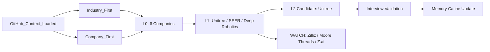

# G-del Daily Loop Trial Report — 2026-07-08

Status: manual trial run
Branch context: `evolution/workflow-system-v1` plus startup-load-reference patch

## 1. Executive summary

- Best actionable signal: Unitree has current official Hangzhou roles in solution engineering, technical support, overseas sales and KA sales.
- Best ecology signal: SEER Robotics has Shanghai AMR controller/software/product ecosystem and overseas/IR signals, but current role evidence was not verified in this run.
- Best second-curve signal: Zilliz remains relevant for AI infrastructure/vector DB, but current China/YRD role evidence is weak today.
- Main risk: several attractive companies have strong product signals but insufficient current role, compensation and employer-quality evidence.

## 2. Mermaid status

## 3. Direction map

| Direction | Status | Today signal | Action |
|---|---|---|---|
| Robotics / embodied AI | Active | Unitree, Deep Robotics and SEER match YRD + AI/robotics direction. | Prioritize Unitree L1; keep SEER/Deep Robotics in queue. |
| AI infrastructure / vector database | Watch | Zilliz has strong product relevance, but China/YRD role fit was not found in parsed careers page. | Search LinkedIn/official roles again later. |
| Domestic AI chips / compute stack | P2/WATCH | Moore Threads has full-stack AI/GPU products and recruitment portal. | Needs exact role and city verification. |
| Large-model commercialization | Watch | Z.ai remains strategic from ledger; current Hangzhou role evidence not verified today. | Dedicated role refresh needed. |

## 4. L0 candidate cards

| Company | City | Subsector | Product / customer signal | Role signal | Stage |
|---|---|---|---|---|---|
| Unitree / 宇树科技 | Hangzhou | Humanoid and quadruped robots | Robot dogs, humanoids, components, industry inspection/fire solutions. | Official current roles: solution engineer, technical support, overseas sales, KA sales. | L1 |
| Deep Robotics / 云深处 | Hangzhou | Quadruped/humanoid robotics | Industrial inspection, emergency rescue, tunnel, metallurgy, surveying, education/research. | Official site links to BOSS; role page blocked in this run. | L0-pass / WATCH |
| SEER Robotics / 仙工智能 | Shanghai | AMR controllers, logistics robots, robot software | Controllers, robots, M4/WMS/RDS software, international site and overseas growth news. | No current role page verified today. | L1 candidate |
| Moore Threads / 摩尔线程 | Beijing + possible national roles | Domestic GPU / AI compute | AI training/inference suites, GPUs, cloud/data-center solutions; social recruitment portal. | Exact sales/solution roles not parsed today. | WATCH |
| Zilliz | Global; China origin not actionable today | Vector database / AI data infrastructure | Milvus, Zilliz Cloud, vector lakebase; parsed open roles mainly overseas. | No China/YRD role found in parsed careers page. | WATCH |
| Z.ai / 智谱 | Beijing / Hangzhou signal from ledger | Large-model MaaS / AI applications | Strategic priority in repo ledger; current Hangzhou role evidence not verified in this run. | Needs dedicated official role search. | WATCH |

## 5. L1 quick screens

| Company | Rating | Why | Largest unknown | Next action |
|---|---|---|---|---|
| Unitree | P1 | Direct YRD role evidence, strong robotics/AI adjacency, role families match solution/technical sales/overseas. | Compensation, work system, team support, customer ownership. | Run L2-lite or interview-validation prep for solution engineer / overseas sales. |
| SEER Robotics | P1/P2 WATCH | Shanghai AMR controller/software ecology + overseas/IR signals. Good industrial customer ecosystem. | Current role and employer-quality evidence. | Find official/open roles or recruiter source; then L1. |
| Deep Robotics | P2/WATCH | Hangzhou embodied robotics, industrial application products; possibly strong direct-fit route. | Role evidence blocked behind BOSS; compensation/work system unknown. | Use alternate sources or direct official contact/search. |

## 6. Evidence gaps

1. Unitree: salary, work system, commission/support boundary, manager/team quality.
2. SEER: current role evidence and hiring channel.
3. Deep Robotics: current role evidence outside blocked BOSS page.
4. Moore Threads: exact YRD/sales/solution role mapping.
5. Z.ai: current Hangzhou MaaS/solution/ecosystem roles.

## 7. Next three actions

1. Run L2-lite on Unitree roles: solution engineer, technical support, overseas sales, KA sales.
2. Search SEER and Deep Robotics roles through official/LinkedIn/猎聘/BOSS alternative sources.
3. Run a focused Z.ai/DeepSeek Hangzhou/Shanghai official-role refresh tomorrow.

## 8. Writeback summary

- Updated July dashboard with Unitree as first L2 candidate.
- Added company queue entries for Unitree, SEER, Deep Robotics, Moore Threads, Zilliz and Z.ai.
- Added evidence gaps for role freshness, compensation/work system and employer quality.
